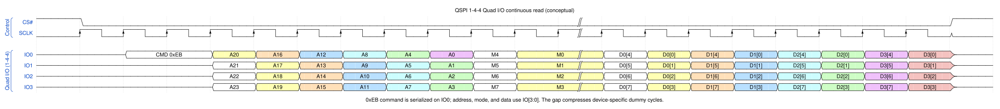
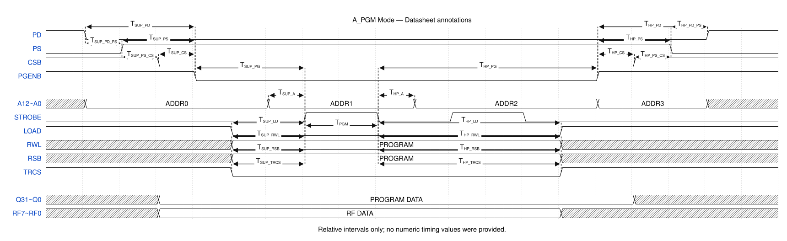

# SoC Agent Skills

Open Agent Skills and MCP tools for SoC design workflows.

Repository: [siliconpeasant/soc_agent_skill](https://github.com/siliconpeasant/soc_agent_skill)

## Skills

| Skill | Purpose | MCP | Spec |
| --- | --- | --- | --- |
| [`soc-integrate`](soc-integrate/) | Generate/refresh a Verilog chip top from submodule ports | Included, stdio | [SKILL.md](soc-integrate/SKILL.md) |
| [`crg-design-gen`](crg-design-gen/) | Requirement table → CRG design workbooks and clock/reset trees | Included, stdio | [SKILL.md](crg-design-gen/SKILL.md) |
| [`wavedrom-gen`](wavedrom-gen/) | Natural language → official WaveDrom JSON5 + SVG/PNG/HTML | Included, stdio | [SKILL.md](wavedrom-gen/SKILL.md) |

Install one skill with the cross-agent `skills` CLI
([Agent Skills spec](https://agentskills.io/specification)):

```bash
npx skills add siliconpeasant/soc_agent_skill --skill soc-integrate -g
npx skills add siliconpeasant/soc_agent_skill --skill crg-design-gen -g
npx skills add siliconpeasant/soc_agent_skill --skill wavedrom-gen -g
```

`-g` is user-global. Drop it for a project-local install, or pick clients with
`-a` (Codex, Claude Code, Cursor, …).

Each skill directory is standalone: **`SKILL.md` is the skill** (agent contract), plus MCP server, scripts, and tests. There is no per-skill README.
Do not treat this repo as a combined SoC build system (`soc-build` lives
elsewhere).

## soc-integrate

Structural top generation: extract ANSI ports, stitch modules, snapshot
interfaces, refresh with `soc_update` **only when listed submodule ports
change**. Unchanged ports: snapshot/CSV is enough — do not regenerate a top
just to close a stage.

```bash
pip install mcp
python3 soc-integrate/scripts/soc_integrate.py integrate \
  soc-integrate/examples/uart.v soc-integrate/examples/gpio.v \
  -n demo_top -o /tmp/demo_top.v \
  --map soc-integrate/examples/port_map.json
```

MCP: `python3 /path/to/soc-integrate/mcp_server.py` (stdio).

## crg-design-gen

Frontend CRG only: req table → design Excel + PLL report, then Draw.io /
Excalidraw trees. It does **not** emit CRG RTL (`crg-gen` is a different
skill). Reset outputs default to `SYNC=N` (combine in CRG, sync-release at
integrate).

```bash
pip install pandas openpyxl mcp
python3 crg-design-gen/scripts/design_main.py \
  crg-design-gen/examples/input/req_table_complex.xlsx output/
```

## wavedrom-gen

Official `wavedrom@3.6.2` engine, local render, no API key.

```bash
cd wavedrom-gen && npm ci --omit=dev
node scripts/register-mcp.mjs --agent generic
```

| Example | Preview |
| --- | --- |
| [QSPI 1-4-4 Quad I/O](wavedrom-gen/examples/qspi-quad-io-read.json5) | [SVG](wavedrom-gen/examples/qspi-quad-io-read.svg) |
| [A_PGM datasheet annotations](wavedrom-gen/examples/a-pgm-mode-datasheet.json5) | [SVG](wavedrom-gen/examples/a-pgm-mode-datasheet.svg) |

<details>
<summary>Preview: QSPI 1-4-4 Quad I/O continuous read</summary>



</details>

<details>
<summary>Preview: A_PGM Datasheet annotations</summary>



</details>

The same official `renderAny` engine and all six shipped skins power
validation, SVG, MCP rendering, and offline HTML. PNG is derived from the
canonical SVG with pinned `@resvg/resvg-js`.

## Develop and test

```bash
python3 soc-integrate/tests/test_parser.py -v

cd wavedrom-gen && npm ci && cd ..
node .github/scripts/wavedrom-gen-self-test.mjs
```

The WaveDrom self-test does a real MCP handshake, discovers tools, validates
WaveJSON, and renders every supported output.
